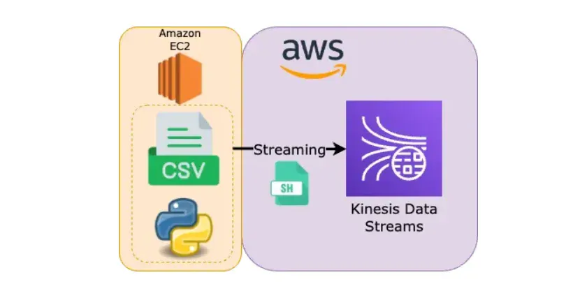

# How to Automate Data Streaming to Amazon Kinesis Data Streams



[](https://github.com/greenwichg/send_data_to_aws_services/tree/main/csv_to_kinesis_streams) 

## Tech Stack

- Python
- Shell Scripting
- Amazon Kinesis Data Streams
- Amazon EC2

## Overview

- We will be running all the scripts inside the EC2 instance. So, we have to first create a new EC2 instance with suitable IAM roles.

- Then we are going to create a Python script that gets a CSV file from a URL. Then, it will stream the CSV data row by row into the Amazon Kinesis Data Streams with predefined interval and length.

- We are going to automate the whole process using a shell script and will be able to monitor live logs.

- This practice can be used to represent a streaming data pipeline.

## IAM Role

We are going to create an IAM role that will give our EC2 instance permission to access Amazon Kinesis. Therefore, we can choose EC2 as the use case.


We are going to choose **AmazonKinesisFullAccess** as the role. It's not the best practice, but since this is a practical guide, we can choose this role. We should, instead, create a dedicated JSON for the specific streams. In the end, we can give it the name **`ec2-kinesis-full-access`**.


## EC2 Instance

We should then create the dedicated EC2 instance with the following parameters:

- **Application and OS Images** → Amazon Linux (Free tier eligible)
- **Instance type** → t2.micro (free tier eligible)
- **Key pair** → We can choose the key pair we created and install .pem file to our local machine
- **Network settings** → Select the existing security group and we can select the one we created (It should include SSH connection as an inbound rule)
- We should choose the IAM role we lately created
- **Name:** **csv-to-kinesis-streams-instance** (You can choose whichever name you want)
- We can leave other fields as default and launch the instance.


## Kinesis Data Streams

**Amazon Kinesis → Data streams → Create data stream**

We can choose **On-demand** or **Provisioned** with the desired number of shards for this project. We can name the Stream as **`csv-to-kinesis-streams-dogukan-ulu`**. (We can define the name as desired, but we have to modify the shell script which will be explained in the next steps.) Since we won't be using a partition key, the shard number depends on our use case at this point.

We can then click on **Create Data Stream**.

## Python Script

We will be using [this CSV file](https://github.com/greenwichg/send_data_to_aws_services/blob/main/csv_to_kinesis_streams/dirty_store_transactions.csv) as an example for the whole process. If you want to use any other URL for the CSV file, you can modify the shell script which will be explained in the next section. You can also see the requirements.txt file which will be automatically installed into the EC2 instance via shell script later.

### Import Libraries and Setup Logger

We have to first import the necessary libraries and define the logger. Logger will be important since we will be monitoring the logs of the script.

```python
import boto3
import csv
import time
import logging
import argparse
import requests
import sys

logging.basicConfig(level=logging.INFO,
                    format='%(asctime)s - %(name)s - %(levelname)s - %(message)s')
logger = logging.getLogger(__name__)
```

### KinesisStreamer Class

We are going to create a class where we handle all Kinesis-related processes. We are going to first create a Kinesis client for all the processes. As you can see, the script is valid for the region `eu-central-1`, but you can easily modify the script if you want to use it for other regions.

`send_record` will be used to send the CSV data to the Kinesis with a predefined stream name and partition key. It also checks if the Kinesis stream exists or not.

```python
class KinesisStreamer:
    def __init__(self, region_name='eu-central-1'):
        self.kinesis_client = boto3.client('kinesis', region_name=region_name)

    def send_record(self, stream_name, data, partition_key="No"):
        try:
            response = self.kinesis_client.put_record(
                StreamName=stream_name,
                Data=data,
                PartitionKey=partition_key
            )
            return response['SequenceNumber']
        except self.kinesis_client.exceptions.ResourceNotFoundException:
            logger.error(f"Kinesis stream '{stream_name}' not found. Please ensure the stream exists.")
            sys.exit(1)
```

### Command Line Arguments

We are now going to define the command line arguments:

- **stream_name** (str): The stream name we already created in the previous steps (`csv-to-kinesis-streams-dogukan-ulu` for this use case)
- **interval** (int): The time interval between two-row uploads
- **max_rows** (int): The maximum number of rows that will be written into the Kinesis stream
- **csv_url** (str): URL of the CSV file

```python
def define_arguments():
    """
    Defines the command-line arguments 
    """
    parser = argparse.ArgumentParser(description="Send CSV data to Kinesis Data Streams")
    parser.add_argument("--stream_name", "-sn", required=True, help="Name of the Kinesis Data Stream")
    parser.add_argument("--interval", "-i", type=int, required=True, help="Time interval (in seconds) between two writes")
    parser.add_argument("--max_rows", "-mr", type=int, default=150, help="Maximum number of rows to write (max: 150)")
    parser.add_argument("--csv_url", "-url", required=True, help="URL of the CSV file")
    args = parser.parse_args()

    return args
```

### Send CSV to Kinesis Function

Now, we are going to send the CSV data row by row to the Kinesis stream. Logs will be showing the uploaded row and sequence number. We are going to check if max_rows exceeds the length of the CSV file. We also check if the URL is accessed correctly.

```python
def send_csv_to_kinesis(stream_name, interval, max_rows, csv_url):
    kinesis_streamer = KinesisStreamer()

    response = requests.get(csv_url)
    response.raise_for_status()
    csv_data = response.text

    csv_reader = csv.reader(csv_data.splitlines())
    next(csv_reader)  # Skip the header row

    rows_written = 0
    try:
        for idx, row in enumerate(csv_reader, start=1):
            data = ','.join(row)
            encoded_data = f"{data}\n".encode('utf-8')  # Encode the data as bytes

            sequence_number = kinesis_streamer.send_record(stream_name, encoded_data)
            logger.info(f"Record sent: {sequence_number} - Row {idx}: {', '.join(row)}")

            time.sleep(interval)

            rows_written += 1
            if rows_written >= max_rows or max_rows > len(csv_data.splitlines()) - 1:
                break
    except KeyboardInterrupt:
        logger.info("Received KeyboardInterrupt signal. Stopping the CSV-to-Kinesis streaming process.")
        sys.exit(0)  # Gracefully exit the script
```

We can run our Python script with the desired command line arguments.

## Shell Script

The first part was creating the Python script, now we are going to automate the running process with a shell script. First of all, we are going to define the location of the log file and the structure of the logs.

```bash
#!/bin/bash

log_file="/project/csv_to_kinesis_streams.log"

# Function to log messages to a log file
log_message() {
    local log_text="$1"
    echo "$(date +'%Y-%m-%d %H:%M:%S') - $log_text" >> "$log_file"
}
```

We can monitor all the logs in `/project/upload_csv_to_s3.log`. Now we have to check the root privileges since we have to run all commands with root privileges without using sudo.

```bash
# Function to check if the script is being run with root privileges
check_root_privileges() {
    if [[ $EUID -ne 0 ]]; then
        log_message "This script is running with root privileges"
        exit 1
    fi
}
```

### Install Required Packages

To prepare the EC2 instance for all the processes, we have to first install the necessary packages, modules, and libraries:

- python3
- pip3
- wget
- unzip

```bash
# Function to install packages using yum
install_packages() {
    local packages=(python3 python3-pip wget unzip)
    log_message "Installing required packages: ${packages[*]}"
    yum update -y
    yum install -y "${packages[@]}"
}
```

### Unzip Files

We are going to start the main process after getting the machine ready. We are going to download the zip file manually which will be explained later. This zip file includes the Python script and requirements.txt. Then, we will unzip the downloaded zip file.

```bash
# Function to unzip the files
unzip_files() {
    log_message "Unzipping the files"
    unzip -o csv_to_kinesis_streams.zip
}
```

### Install Python Libraries

To run our Python script, we have to have all the libraries and packages installed in the instance. Therefore, we are going to install all of them if not exist.

```bash
# Function to install required Python libraries
install_python_libraries() {
    local requirements_file="requirements.txt"
    log_message "Installing Python libraries from $requirements_file"
    pip3 install -r "$requirements_file"
}
```

### Execute Python Script

Here comes the main part. We are going to define all the command line arguments in the below function. Then, we will run the Python script with those arguments. This part might be modified if necessary.

```bash
# Function to execute the Python script
execute_python_script() {
    local csv_to_kinesis_streams_script="csv_to_kinesis_streams.py"
    local stream_name="csv-to-kinesis-streams-dogukan-ulu"
    local interval=5
    local max_rows=100
    local csv_url="https://raw.githubusercontent.com/dogukannulu/send_data_to_aws_services/main/csv_to_kinesis_streams/dirty_store_transactions.csv"
    
    log_message "Executing the Python script"
    chmod +x "$csv_to_kinesis_streams_script"
    python3 "$csv_to_kinesis_streams_script" --stream_name "$stream_name" \
        --interval "$interval" \
        --csv_url "$csv_url" \
        --max_rows "$max_rows"
}
```

### Main Function

In the end, we are going to combine all these and log all the stdout and stderr into the log file.

```bash
# Main function to run the entire script
main() {
    log_message "Starting the script"
    check_root_privileges
    install_packages
    download_zip_file
    unzip_files
    install_python_libraries
    execute_python_script
    log_message "Script execution completed"
}

# Run the main function and redirect stdout and stderr to the log file
main >> "$log_file" 2>&1
```

## Automate the Process

We have understood how Python and shell scripts exactly work. Here comes the only part that we will be running inside the EC2 instance. First of all, we have to be located in the root directory. All the processes will be in `/project` directory. We will download the shell script in `/project`.

If any modification is necessary for the shell script, we can run `sudo vi setup.sh`. If not, we are only going to run the below commands:

```bash
sudo mkdir /project
cd /project
sudo curl -O https://raw.githubusercontent.com/dogukannulu/send_data_to_aws_services/csv_to_kinesis_refactor/csv_to_kinesis_streams/setup.sh
sudo chmod +x setup.sh
sudo wget https://github.com/dogukannulu/send_data_to_aws_services/raw/main/csv_to_kinesis_streams/csv_to_kinesis_streams.zip
sudo ./setup.sh
sudo tail -f /project/csv_to_kinesis_streams.log
```

### What These Commands Do

1. Create the directory `/project` and change the directory into it
2. Download the `setup.sh` into the EC2 instance
3. Make `setup.sh` executable
4. Download the zip file
5. Execute `setup.sh`
6. Monitor the live logs (This might require opening another terminal window)

In the end, you can check each shard of Kinesis streams by choosing **Trim Horizon** to get all the records from the beginning.

---

Hope it helps, thanks for reading! :)
