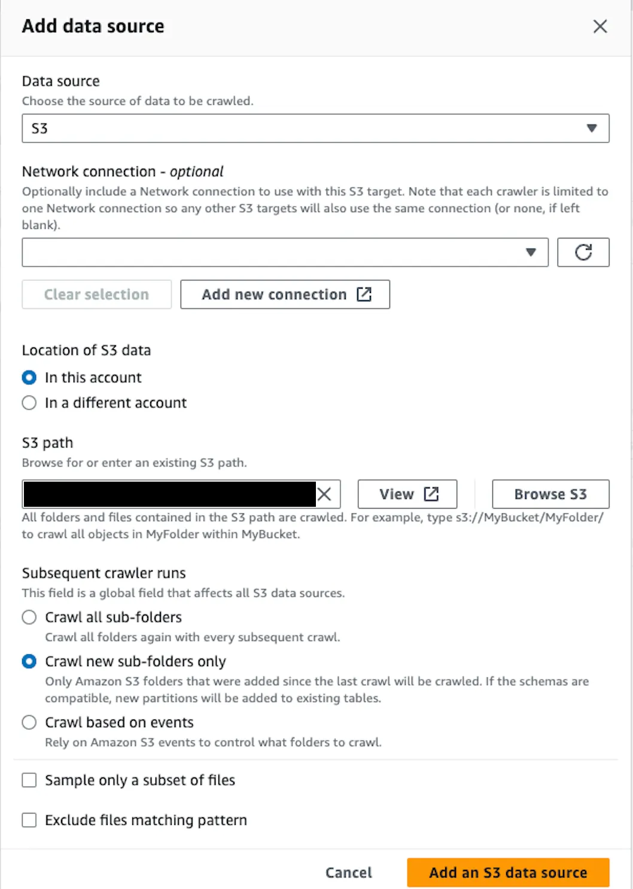
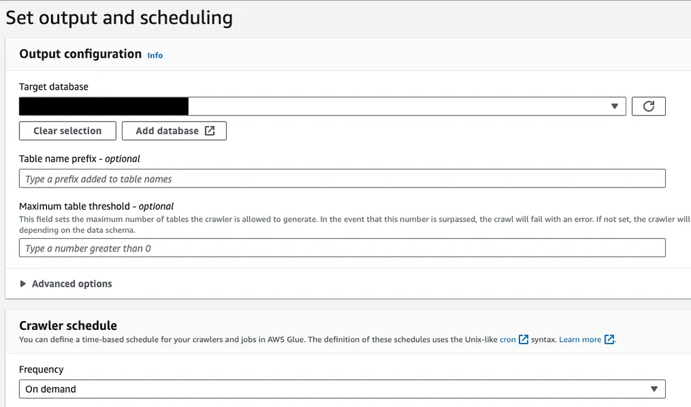
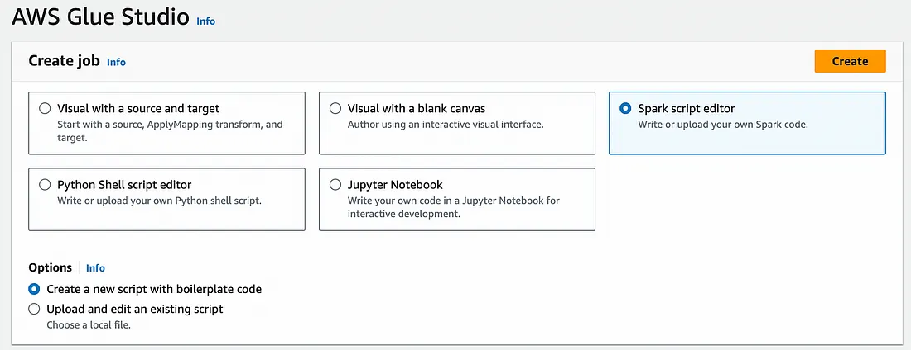

# Creating AWS Glue Workflows with Glue Crawler and Glue ETL Jobs

---

## AWS Orchestration Services

AWS provides us with some orchestration services and we can run our tasks and jobs in an order using these orchestration tools. These services can be listed as below:

- **MWAA** (Amazon Managed Workflows for Apache Airflow)
- **Step Functions**
- **AWS Glue Workflow**

In this article, I will explain how to create a Glue Workflow with some various options.

## AWS Glue Workflow Components

An AWS Glue Workflow consists of 3 main components:

1. **Triggers**
2. **Glue Crawlers**
3. **Glue ETL Jobs**

We can use all these services in any order depending on our use case. I am going to explain a case where we will be using a trigger first, then we are going to create a Glue Crawler, which will create another trigger and we will run a Glue ETL job.

## Glue Crawler

First of all, we should be located in the Glue dashboard. We are going to create the crawler. We are going to name our Crawler and then choose the source location as **S3** and specify the location of our data. If we want it to crawl all the files, we can define the location as a directory under a certain S3 bucket.

### Configure Data Source

We can choose a Glue Data Catalog table as well. But if our table hasn't been created yet, we have to choose **Not yet** as the first option. We are going to define our S3 location. 

Depending on our use case, we can choose:
- **Crawl all sub-folders** 
- **Crawl new sub-folders only** - If new files are uploaded into the S3 bucket every time we run our pipeline and we only want to crawl them

### IAM Role and Target Database

We should choose the IAM role that the Crawler will be using so that it includes necessary S3 permissions.

We should choose a target database in which our resulting Glue table will be located.

### Table Prefix and Schedule

We can choose a prefix for the resulting table. If we don't choose, the name of our target table will be the same as the S3 directory. We should choose the schedule as **on demand** since it will be triggered by a trigger.

After defining all the parameters, we can create our Crawler. We have to create the Glue ETL Job since it will also be needed while creating our workflow.

## Glue ETL Job

We have to create our Glue ETL job with any suitable option for our use case. We are going to use **Spark script** for this example.

You may find a [sample Glue ETL job Spark Script here](https://github.com/dogukannulu/glue_etl_job_data_catalog_s3). We have to decide the number of DPUs and worker types accordingly. After creating the script of our job, we can save it with a proper name. 

In the end, we have a Crawler and a Glue ETL Job. We can now create the workflow.

## Glue Workflow

On the main page of Glue Workflow, we should set the initial trigger. Once we choose it to be a trigger, we will have some options.

### Initial Trigger Options

We can manually trigger it with **On demand** option as an example. We should also run the trigger on a schedule. We can use [crontab.guru](https://crontab.guru/) to obtain the suitable schedule that we will be using. 

**Example schedules:**
- `*/2 * * * *` - will run the job every 2nd minute
- We can also choose from the drop-down list (hourly, daily, etc.)

### Workflow Structure

Once we set our trigger, we can add a node after our initial trigger. It will be the crawler we recently created. Up to this point, the initial trigger will make the crawler start running. 

Right after the crawler, we can add another trigger which will be triggered with **ALL** or **ANY** events after the crawler depending on our choice. 

In the end, we can add the Glue ETL job. 

### Final Workflow Components

In the end, we are going to have a workflow with 4 components:
1. 1 Crawler
2. 2 Triggers
3. 1 ETL Job

Let's say our ETL job will load the resulting data to S3 and create a corresponding Glue table. One of the ways of checking our workflow's success is by checking the related Glue database or S3 bucket.

### Monitoring Workflow Execution

You can see a sample workflow above. Once the workflow is triggered, we can check the crawler page and we should see **Running**. After seeing the status as **Succeeded**, our ETL job will be triggered and we should see the same status updates for that as well. Depending on our use case of the workflow, we can check the resulting data and see if it is actually successful or not.

## Customization

The components of the Glue workflows might change depending on our use cases. We can add more crawlers, ETL jobs, or triggers. This article explains the core components of a workflow and how we can create all of them.

---
