# AWS Cloud Engineering Project — Part 1 — AWS Glue, Lambda, Kinesis, Redshift, Athena, QuickSight, S3, EC2, Spark

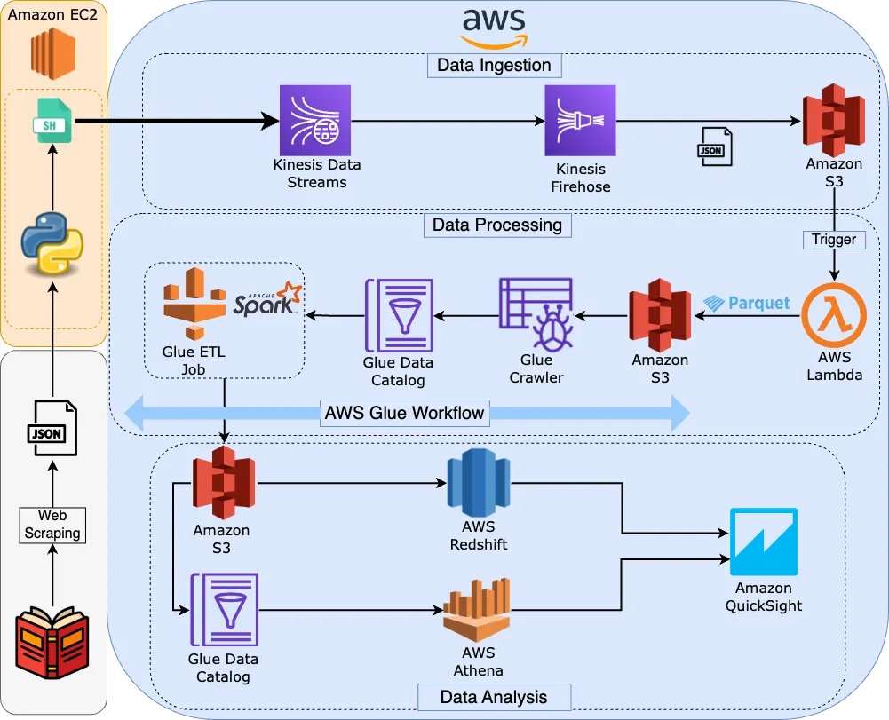

[](https://github.com/greenwichg/aws_end_to_end_streaming_pipeline)

---

## Tech Stack

- AWS Kinesis Data Streams
- AWS Kinesis Firehose
- Amazon S3
- AWS Lambda
- AWS Glue Crawler
- AWS Glue ETL Job
- AWS Glue Workflow
- AWS Glue Data Catalog
- AWS Redshift
- AWS Athena
- Amazon QuickSight
- Amazon EC2
- Apache Spark
- Web Scraping
- Shell Scripting
- **File formats:** Parquet, JSON
- **Languages:** Python, SQL

## Overview

In this article, we are going to create an end-to-end streaming pipeline on AWS. I separated the whole pipeline into 3 main stages:

1. **Data Ingestion**
2. **Data Processing**
3. **Data Analysis**

In the first part of the article, we are going to go through the data ingestion part. We are going to create a very simple web scraping script that we will be scraping [Books to Scrape](http://books.toscrape.com) website. We are going to upload the resulting JSON file into the GitHub repo.

After these, we are going to create a new EC2 instance. In the while, we also have to create the S3 bucket to which we will send the data from Kinesis Firehose. Since we are going to send the streaming data to Kinesis Data Streams and buffer it with Kinesis Firehose, we will also create them accordingly.

After all is created, we will start streaming the JSON data record by record to the Kinesis data streams from inside the EC2 instance.

We can think of this project as a complete streaming pipeline. We are going to go through only a single step of the streaming but if we keep streaming the data every minute, we will be able to obtain a streaming pipeline.

## Web Scraping

📂 [View web scraping code on GitHub](https://github.com/dogukannulu/aws_end_to_end_streaming_pipeline/tree/main/web_scraping)

First of all, we should install all the necessary dependencies in the [requirements.txt](https://github.com/greenwichg/aws_end_to_end_streaming_pipeline/tree/main/web_scraping) file. We will now go through the scraping script.

### Extract Book Details

In the first part of the script, we are going to determine the availability of the books we are scraping by getting the response from the website.

```python
class BookScraper:
    def __init__(self, base_url):
        self.base_url = base_url

    def extract_details(self, detail_url):
        try:
            response = requests.get(detail_url)
            response.raise_for_status()
            soup = BeautifulSoup(response.content, "html.parser")

            availability = "In stock"
            availability_element = soup.find("p", class_="instock availability")
            if availability_element:
                availability_text = availability_element.text.strip()
                if "In stock" not in availability_text:
                    availability = "Out of stock"

            return availability
        except requests.RequestException as e:
            logger.error(f"Error extracting details from {detail_url}: {e}")
            return "Unknown"
```

### Scrape Books Function

The second function of the class `BookScraper` will be used to extract other details like title, price, and number of reviews and will create UPC accordingly.

```python
def scrape_books(self, url):
    try:
        response = requests.get(url)
        response.raise_for_status()
        soup = BeautifulSoup(response.content, "html.parser")

        books = []

        for article in soup.find_all("article", class_="product_pod"):
            title = article.h3.a["title"]
            price = article.find("p", class_="price_color").text.strip()

            rating_element = article.find("p", class_="star-rating")
            num_reviews = rating_element.attrs["class"][1]

            product_url = urljoin(self.base_url, article.h3.a["href"])
            availability = self.extract_details(product_url)

            upc = "f" + hex(hash(title))[2:] + hex(hash(price))[2:]

            books.append({
                "title": title,
                "price": price,
                "num_reviews": num_reviews,
                "upc": upc,
                "availability": availability
            })

        return books
    except requests.RequestException as e:
        logger.error(f"Error scraping books from {url}: {e}")
        return []
```

### Main Function

In the main function, we will combine the previous functions. In the end, we will create a [JSON file](https://github.com/greenwichg/aws_end_to_end_streaming_pipeline/blob/main/web_scraping/books_data.json). Each record in this JSON file will include 5 keys, which means that we will have a 5-column data frame in the end.

```python
def main():
    base_url = "http://books.toscrape.com"
    total_pages = 10
    data = []

    scraper = BookScraper(base_url)

    for page_num in range(1, total_pages + 1):
        page_url = f"{base_url}/catalogue/page-{page_num}.html"
        page_data = scraper.scrape_books(page_url)
        data.extend(page_data)

    for book in data:
        book["availability"] = random.choice(["In stock", "Out of stock"]) # assigned randomly

    try:
        with open("books_data.json", "w") as json_file:
            json.dump(data, json_file, indent=4)
        logger.info(f"Scraped and saved {len(data)} book entries.")
    except Exception as e:
        logger.error(f"Error saving data to JSON: {e}")
```

## Amazon S3 Bucket

The first thing we have to do is to create an S3 bucket. We are going to use this bucket for Firehose to upload the data. From the S3 dashboard → Create bucket:

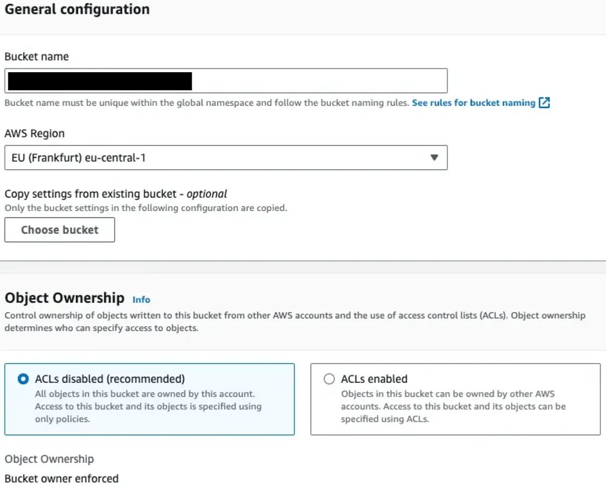

We can leave all other parameters as default. In the end, we can click on **Create bucket** (`kinesis-firehose-books-json-dogukan-ulu`).

## IAM Role

We are going to create an IAM role that will give our EC2 instance the necessary permissions to access Amazon Kinesis. Therefore, we can choose EC2 as the use case.

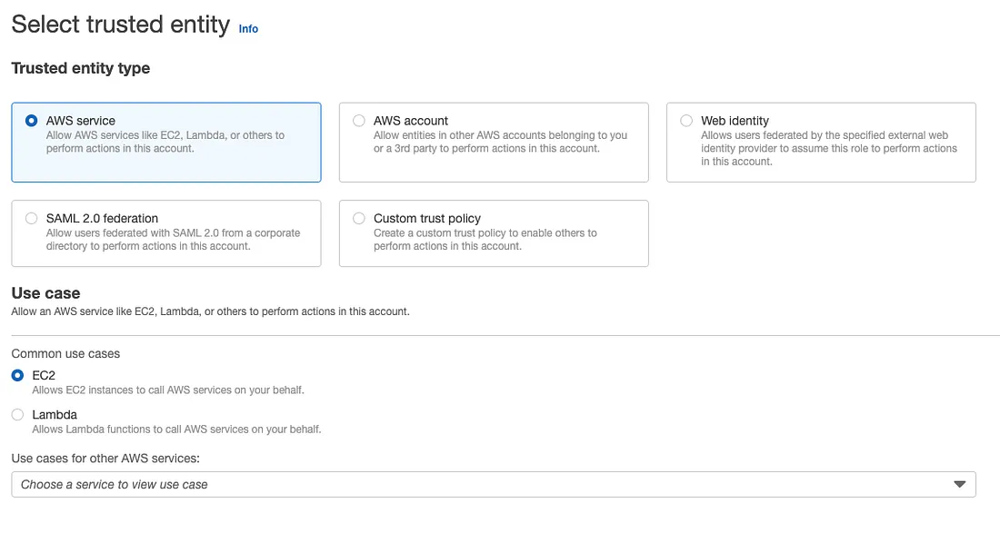

We are going to choose **AmazonKinesisFullAccess** as the role. It's not a best practice, but since this is a practical guide, we can choose this role. We should, instead, create a dedicated JSON for the specific streams. In the end, we can give it the name `ec2-kinesis-full-access`.

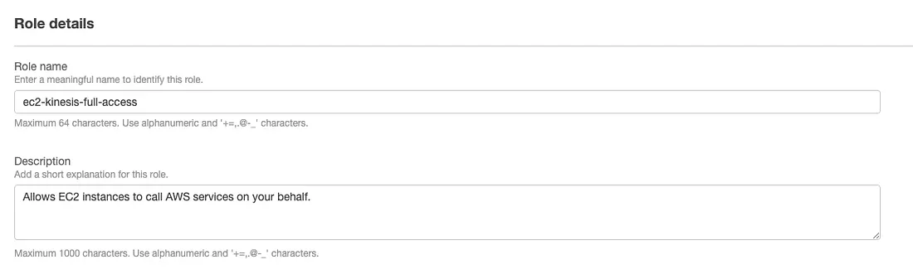

## EC2 Instance

We should then create the dedicated EC2 instance with the following parameters:

- **Application and OS Images** → Amazon Linux (Free tier eligible)
- **Instance type** → t2.micro (free tier eligible)
- **Key pair** → We can choose a suitable key pair and install the .pem file to our local machine
- **Network settings** → Select a suitable security group. (It should include SSH connection as the inbound rule)
- We should choose the IAM role we recently created
- **Name:** json-to-kinesis-streams-ec2-instance
- We can leave other fields as default and launch the instance.

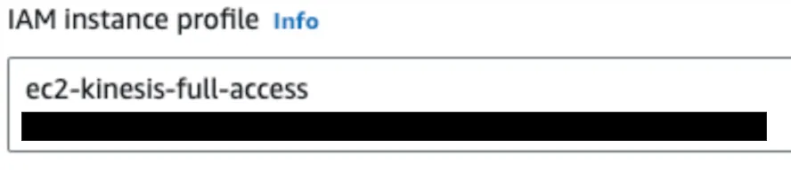

## Kinesis Data Streams

Amazon Kinesis → Data streams → Create data stream

We are going to choose **Provisioned** with one shard since we will need only one shard for this project (We are going to use a hard-coded partition key. That's why we need one shard only). We can name the Stream as `json-to-kinesis-streams-dogukan-ulu`. This part is important since our script will be using this name. If we want to name our data stream differently, we should also modify the upcoming shell script accordingly.

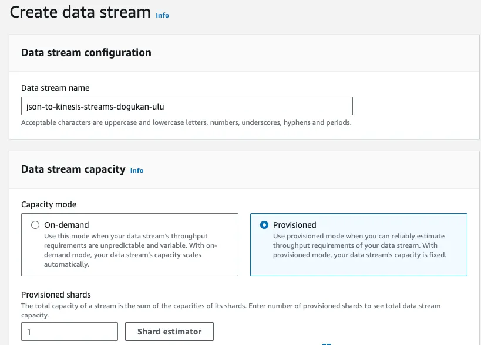

We can then click on **Create Data Stream**.

## Kinesis Firehose

When it comes to the Firehose, we have to select the source as **Data Streams** and the destination as **Amazon S3**. We have to populate our Data Stream name (`json-to-kinesis-streams-dogukan-ulu`) for the Source settings. We can name our Delivery stream name as `json-to-kinesis-firehose-dogukan-ulu`.

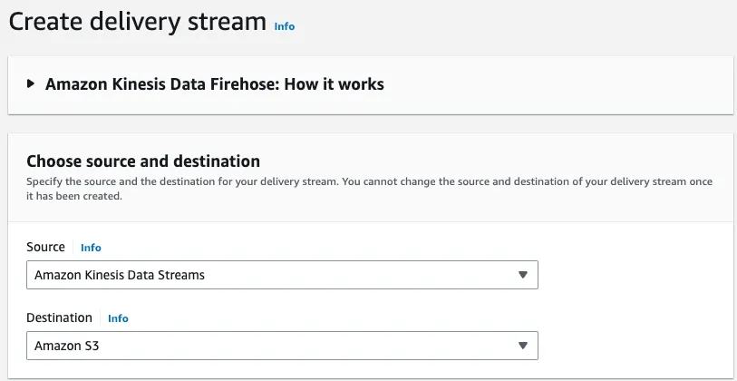

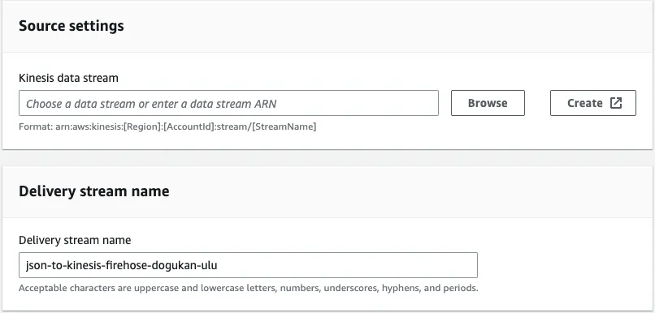

### Destination Settings

When it comes to Destination settings, we can choose the S3 bucket we recently created. Data will be uploaded into the prefixes like `year/month/day/hour`. We better define the additional prefix as `json_data/` so that our data will be uploaded into that directory.

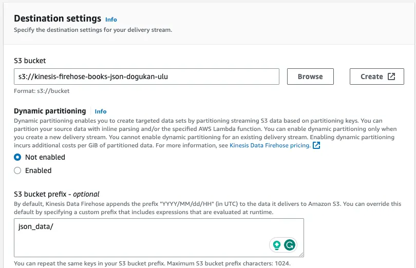

### Buffer Configuration

And we should set **Buffer hints, compression, and encryption** → **Buffer interval** as **60 seconds**. The Python script is going to send 60 records and the time interval between two records will be 1 second. To conclude, it will be uploaded into the S3 bucket as a single file.

## Start Streaming

📂 [View streaming code on GitHub](https://github.com/greenwichg/aws_end_to_end_streaming_pipeline/tree/main/json_to_kinesis_streams)

In this section, we will walk through all the scripts and how the streaming will work. Assuming we are already inside our EC2 instance (root directory) by connecting it via SSH, we are going to create a dedicated directory `/project` for our instance. Then, we will download the shell script to our instance, make it executable and run it.

```bash
sudo mkdir /project
cd /project
sudo curl -O https://raw.githubusercontent.com/dogukannulu/aws_end_to_end_streaming_pipeline/main/json_to_kinesis_streams/setup.sh
sudo chmod +x setup.sh
sudo wget https://github.com/dogukannulu/aws_end_to_end_streaming_pipeline/raw/main/json_to_kinesis_streams/json_to_kinesis_streams.zip
sudo ./setup.sh
```

### Monitor Streaming Logs

Once we trigger the shell script, we can monitor the streaming data from another EC2 terminal with the below command:

```bash
sudo tail -f /project/json_to_kinesis_streams.log
```

### Shell Script Overview

We will download the remote zip file (it includes the [Python script](https://github.com/dogukannulu/aws_end_to_end_streaming_pipeline/blob/main/json_to_kinesis_streams/json_to_kinesis_streams.py) and [requirements.txt](https://github.com/greenwichg/aws_end_to_end_streaming_pipeline/blob/main/json_to_kinesis_streams/requirements.txt)) ourselves. The [setup.sh](https://github.com/greenwichg/aws_end_to_end_streaming_pipeline/blob/main/json_to_kinesis_streams/setup.sh) script will install pip3, python3, and wget first, and run the Python script that will send the JSON data record by record to Kinesis Data Streams for a predefined time interval. You may see the content of the script below. Each section's purpose is written with comments.

```bash
#!/bin/bash

log_file="/project/json_to_kinesis_streams.log"

# Function to log messages to a log file
log_message() {
    local log_text="$1"
    echo "$(date +'%Y-%m-%d %H:%M:%S') - $log_text" >> "$log_file"
}

# Function to check if the script is being run with root privileges
check_root_privileges() {
    if [[ $EUID -ne 0 ]]; then
        log_message "This script is running with root privileges"
        exit 1
    fi
}

# Function to install packages using yum
install_packages() {
    local packages=(python3 python3-pip wget unzip)
    log_message "Installing required packages: ${packages[*]}"
    yum update -y
    yum install -y "${packages[@]}"
}

# Function to unzip the files
unzip_files() {
    log_message "Unzipping the files"
    unzip -o json_to_kinesis_streams.zip
}

# Function to install required Python libraries
install_python_libraries() {
    local requirements_file="requirements.txt"
    log_message "Installing Python libraries from $requirements_file"
    pip3 install -r "$requirements_file"
}

# Function to execute the Python script
execute_python_script() {
    local json_to_kinesis_streams_script="json_to_kinesis_streams.py"
    local stream_name="json-to-kinesis-streams-dogukan-ulu"
    local interval=1
    local max_records=60
    local json_url="https://raw.githubusercontent.com/dogukannulu/aws_end_to_end_streaming_pipeline/main/json_to_kinesis_streams/books_data.json"
    
    log_message "Executing the Python script"
    chmod +x "$json_to_kinesis_streams_script"
    python3 "$json_to_kinesis_streams_script" --stream_name "$stream_name" \
        --interval "$interval" \
        --json_url "$json_url" \
        --max_records "$max_records"
}

# Main function to run the entire script
main() {
    log_message "Starting the script"
    check_root_privileges
    install_packages
    download_zip_file
    unzip_files
    install_python_libraries
    execute_python_script
    log_message "Script execution completed"
}

# Run the main function and redirect stdout and stderr to the log file
main >> "$log_file" 2>&1
```

We may change all the command line arguments depending on our use case. 

**For related articles:**
- [How to Automate Data Streaming to Amazon Kinesis Data Streams](https://medium.com/@dogukannulu/how-to-automate-data-streaming-to-amazon-kinesis-data-streams)

For a very similar process for remote CSV files, you can take a look at the below article.

- [How to Stream CSV Data from Amazon Kinesis Data Streams to S3 Through Firehose](https://medium.com/@dogukannulu/how-to-stream-csv-data-from-amazon-kinesis-data-streams-to-s3-through-firehose)

## Python Script

Now, we are going to walk through the Python script. First, we have to import all the necessary libraries. They should be installed once we run the shell script.

### Define Command-Line Arguments

Since we have to use command-line arguments, we should first define them as a function.

```python
def define_arguments():
    """
    Defines the command-line arguments 
    """
    parser = argparse.ArgumentParser(description="Send JSON data to Kinesis Data Streams")
    parser.add_argument("--stream_name", "-sn", required=True, help="Name of the Kinesis Data Stream")
    parser.add_argument("--interval", "-i", type=int, required=True, help="Time interval (in seconds) between two writes")
    parser.add_argument("--max_records", "-mr", type=int, default=150, help="Maximum number of records to write")
    parser.add_argument("--json_url", "-url", required=True, help="URL of the JSON data")
    args = parser.parse_args()

    return args
```

**Arguments:**
- **stream_name**: We are going to define the stream name (`json-to-kinesis-streams-dogukan-ulu` for this project) that we will stream our data
- **interval**: We have to define it as an integer. This will determine how many seconds will be required between two records
- **max_records**: How many records do we want to write to the stream? Should be defined as an integer
- **json_url**: The remote JSON file's URL

### Kinesis Streamer Class

We have to define the Kinesis client that we are going to use to send the records. We can define the region name for our own use case.

```python
class KinesisStreamer:
    def __init__(self, region_name='eu-central-1'):
        self.kinesis_client = boto3.client('kinesis', region_name=region_name)

    def send_record(self, stream_name, data, partition_key="No"):
        try:
            response = self.kinesis_client.put_record(
                StreamName=stream_name,
                Data=data,
                PartitionKey=partition_key
            )
            return response['SequenceNumber']
        except self.kinesis_client.exceptions.ResourceNotFoundException:
            logger.error(f"Kinesis stream '{stream_name}' not found. Please ensure the stream exists.")
            sys.exit(1)
```

### Send JSON to Kinesis

Here comes the main part. We are going to send the JSON data record by record to the stream.

```python
def send_json_to_kinesis(stream_name, interval, max_records, json_url):
    """
    Streams the JSON data into Kinesis data streams
    """
    kinesis_streamer = KinesisStreamer()

    response = requests.get(json_url)
    response.raise_for_status()
    json_data = response.json()

    records_sent = 0
    try:
        for idx, record in enumerate(json_data, start=1):
            encoded_data = json.dumps(record).encode('utf-8')

            sequence_number = kinesis_streamer.send_record(stream_name, encoded_data)
            logger.info(f"Record sent: {sequence_number} - Record {idx}: {json.dumps(record)}")

            time.sleep(interval)

            records_sent += 1
            if records_sent >= max_records or max_records > len(json_data):
                break
    except KeyboardInterrupt:
        logger.info("Received KeyboardInterrupt signal. Stopping the JSON-to-Kinesis streaming process.")
        sys.exit(0)  # Gracefully exit the script
```

It will send the JSON data according to the defined interval and maximum number of records. If the maximum number of records is reached, it will stop sending.

### Main Execution

We should combine all these as below so that they are called once we run the script.

```python
if __name__ == "__main__":
    args = define_arguments()

    logger.info(f"Processing JSON data from URL: {args.json_url}")
    send_json_to_kinesis(args.stream_name, args.interval, args.max_records, args.json_url)
```

### Script Execution Logs

Once we run the shell script, we will start seeing each log on the command line of the EC2 instance. We can see that the time interval is 1 second between two logs as we defined in the shell script.

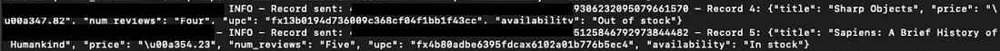

The long number on the right-hand side will be the sequence number.

> A Kinesis data stream is a set of shards. Each shard has a sequence of data records. Each data record has a sequence number that is assigned by Kinesis Data Streams (Amazon Web Services).

## Monitor the Data on Kinesis Data Streams and S3 Bucket

We can check the data on the Kinesis Data Streams dashboard by choosing **Trim Horizon** and getting the data from our shard. Since we have only one shard, we can choose that one.

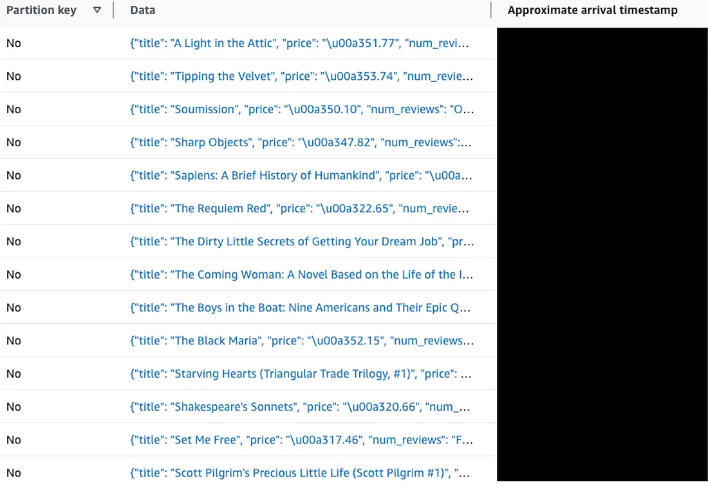

### Check S3 Bucket

We can also check the S3 bucket. We determined the buffer time limit as 60 seconds for Firehose. We are going to send the data every second and 60 records in total. It will take 1 minute in total to write the whole data. Therefore, there should be one single file for the written data as we can see below. You may also see the prefixes of the data which show `year/month/day/hour` breakdown. The file name will be determined due to the Delivery Stream name and date. You may also check the prefix `json_data/`.

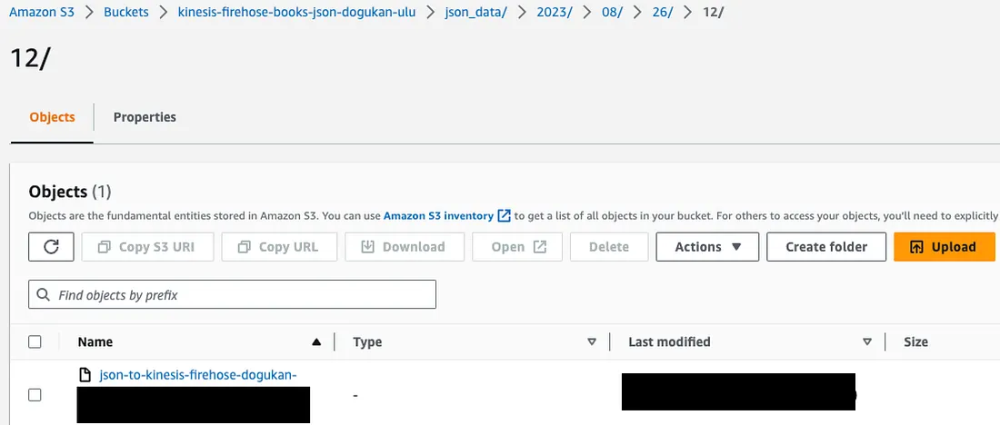

We can select the file and download that to our local to check how its content is designed. In the end, we will be able to see the combined JSON data with our favorite text editor. You can see the [sample Firehose JSON data here](https://github.com/dogukannulu/aws_end_to_end_streaming_pipeline/tree/main/json_to_kinesis_streams).

## Next Steps

If everything seems correct up until this point, we can move on to the next section: **Data processing**. We are going to run these steps again since we want to trigger the upcoming Lambda function with the S3 object upload.

---
