# AWS Cloud Data Engineering End-to-End Project — EMR, EC2, Glue, S3, Spark, Zeppelin

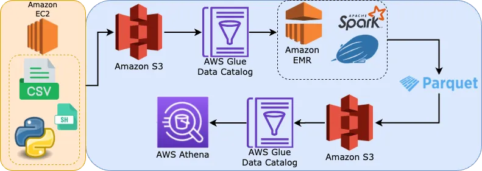

[](https://github.com/greenwichg/glue_etl_job_data_catalog_s3/tree/main/emr_zeppelin)

---

## Tech Stack

- AWS EMR
- AWS S3
- AWS Glue
- AWS EC2
- AWS Athena
- Apache Spark
- Zeppelin Notebook
- SQL
- Shell Scripting
- Parquet file format

## Overview

In this project, we are going to upload a CSV file into an S3 bucket either with automated Python/Shell scripts or manually. We are going to create a corresponding Glue Data Catalog table. The main part will be establishing a new EMR cluster. After creating it, we are going to run a Spark job with Zeppelin Notebook and modify the data. After modifications, we are going to write the data to S3 as a parquet file. A Glue Data Catalog table will also be created. We will monitor the data using AWS Athena and S3 Select in the end.

## S3 Bucket

In this project, we will need **3 buckets**: source, target, and log. 

We will upload the source data into the source bucket. The source bucket's name will be a unique name that describes the process (`dirty-transactions-from-csv-to-parquet` for this project). We will upload our [initial CSV file](https://github.com/greenwichg/glue_etl_job_data_catalog_s3/blob/main/data_sources/dirty_transactions.csv) into this bucket with the key `dirty_transactions/dirty_transactions.csv`. 

If we want to upload the data automatically from inside the EC2 instance, all details can be found in the article: [How to Automate Data Upload to Amazon S3](https://github.com/greenwichg/aws_data_services_guide/blob/main/materials/ec2_to_s3_upload.md).

If we want to create the S3 bucket manually, we can do it via the S3 dashboard directly or upload the CSV file using AWS CLI. 

### Bucket Names

- **Source bucket:** `dirty-transactions-from-csv-to-parquet`
- **Target bucket:** `aws-glue-emr-from-csv-to-parquet` (This part is important since the bucket name should include "aws-glue", if not we should define some other permissions)
- **Log bucket:** `s3-from-csv-to-parquet-aws-emr-logs` (for EMR logs)

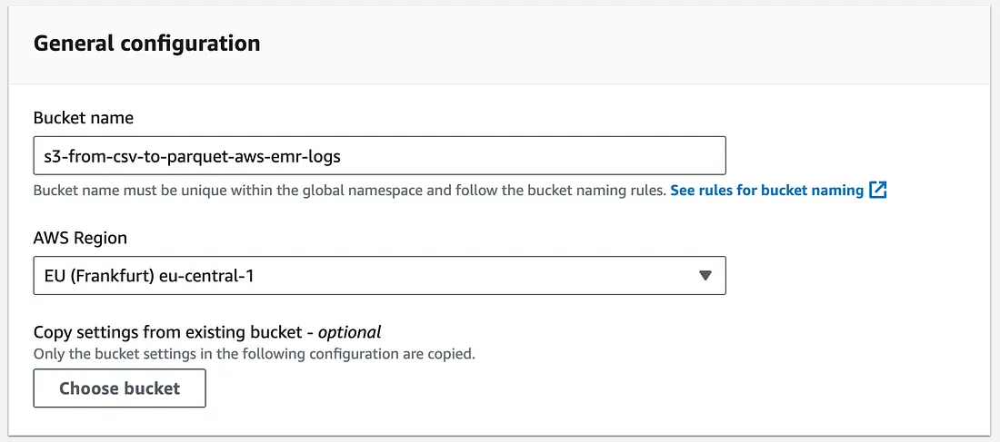

## Glue Data Catalog

In this part, the first thing is creating a new database. We can create the database from **AWS Glue** → **Databases** → **Add database**. We can name it `dirty-transactions-from-csv-to-parquet`, the same as the bucket name.

### Create Table

The second part is creating a new table in this database. We are going to use this table to keep the metadata of the object we recently put into the S3 bucket. We can define the schema manually. Our table name will be `dirty_transactions` (the same as the S3 prefix).

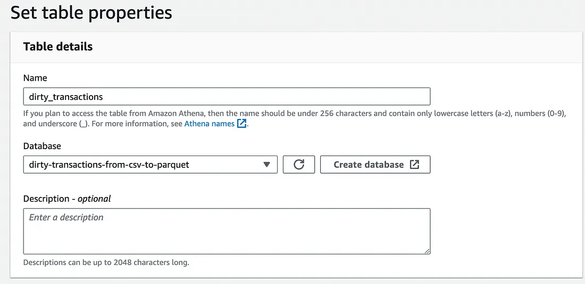

We are going to choose the source data as **S3** and browse the location of our newly created object. Be careful that we should choose the directory instead of the file itself at this point.

For our data `dirty_transactions`, we should choose the data type as **CSV** and define the schema manually.

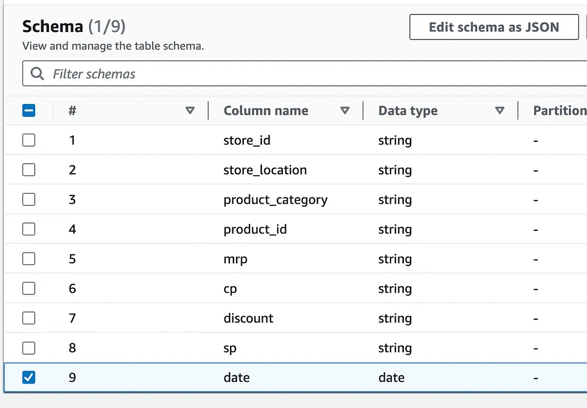

After all, we can create our Glue Data Catalog table.

## Security Group

To be able to define while creating the EMR cluster, we should create a security group named `aws_emr_security_group`. We can define all the necessary inbound rules after creation. The necessary cluster-related inbound rules will be created after the creation of the cluster.

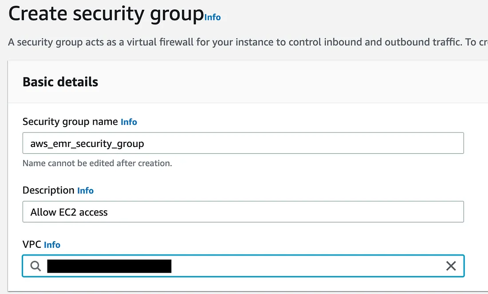

## Amazon EMR

We are going to create an AWS EMR cluster and use Spark with Zeppelin Notebook. We will follow the below steps to create the cluster. Our cluster's name will be `csv-from-s3-to-parquet-cluster`.

### Cluster Configuration

We are going to check **Use for Spark table metadata** so that we are going to use the Glue Data Catalog table along with EMR. We can choose the latest release for Amazon EMR.

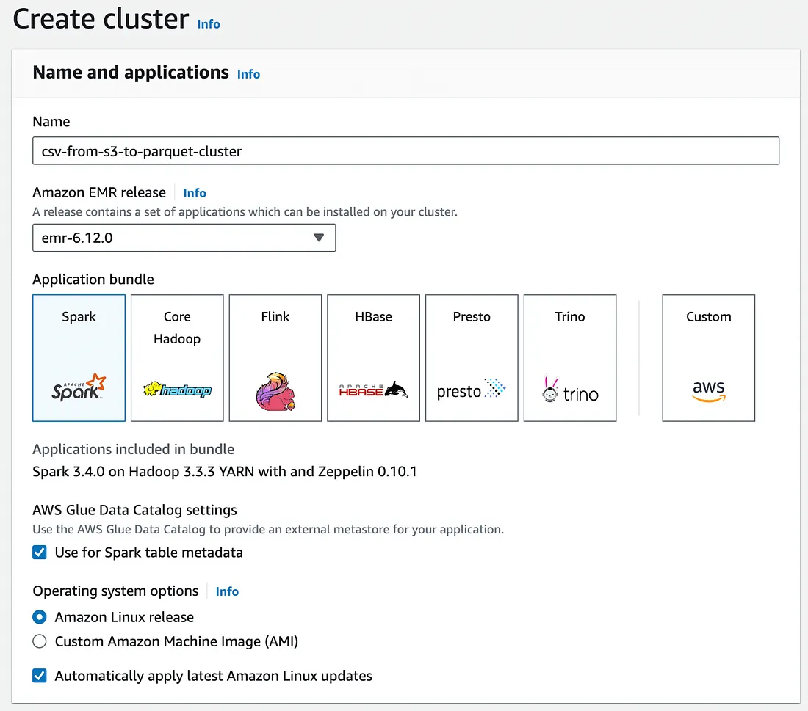

### Instance Configuration

When it comes to the instances, we will only need **1 primary** and **1 core** instance. We can remove the task instance since we don't need it. The instance type depends on our workload and I chose **m5.xlarge** for this project. If suitable, you may choose cheaper instances as well.

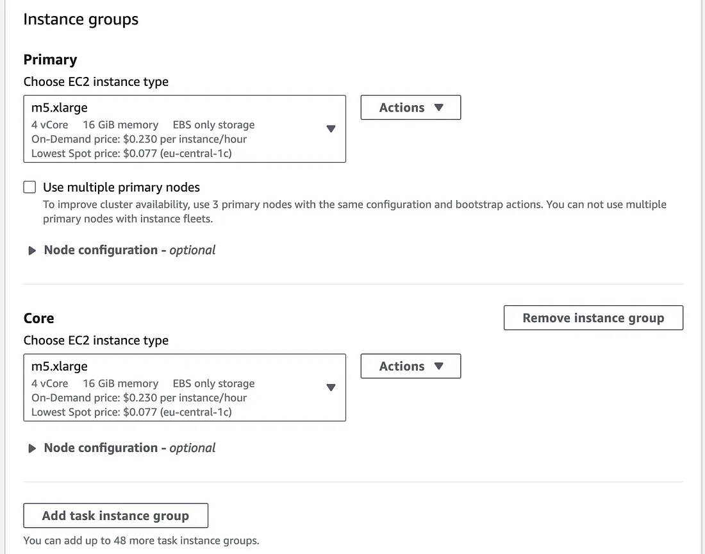

We will choose the cluster instance size as **1** for this specific project.

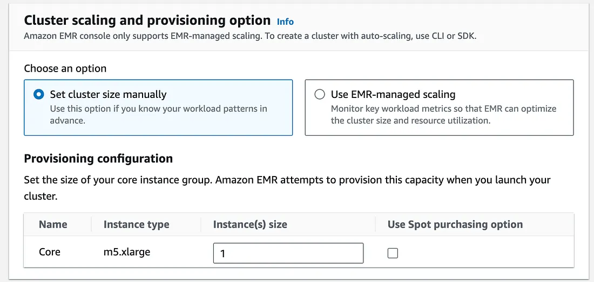

### Network Settings

We can choose the default VPC or we can also create a specific VPC for this use case. We can also choose private/public subnet. Since this is a demo project, we can choose a public subnet. But I definitely recommend choosing a private subnet for production use. 

If you want to have more information about establishing a VPC, you may see the article: [Establishing a VPC for Amazon S3, Lambda, RDS and EC2](https://medium.com/@dogukannulu/establishing-a-vpc-for-amazon-s3-lambda-rds-and-ec2-8f3aa53b5429).

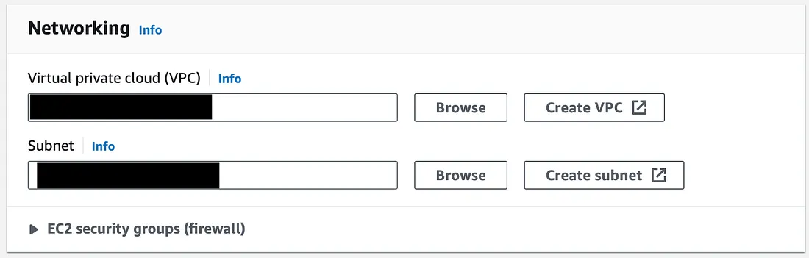

### Termination Settings

Since the instances will cost us a bit much, we better set a termination time for our clusters. I chose it to be **1 hour**, but you might define it depending on your use case.

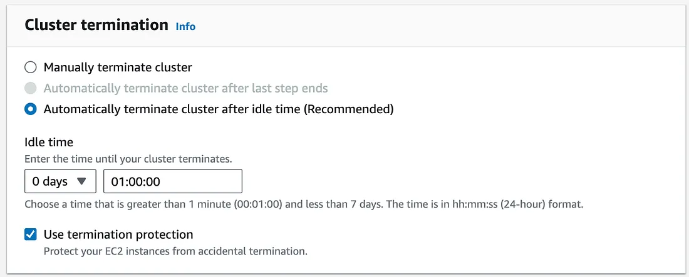

### Service Roles and Security

If this is the first time we create an EMR cluster, we better choose **"Create a service role"**. VPC and subnet will be determined automatically since we already defined them in the previous steps. We can choose the security group as the one we created previously (`aws_emr_security_group`).

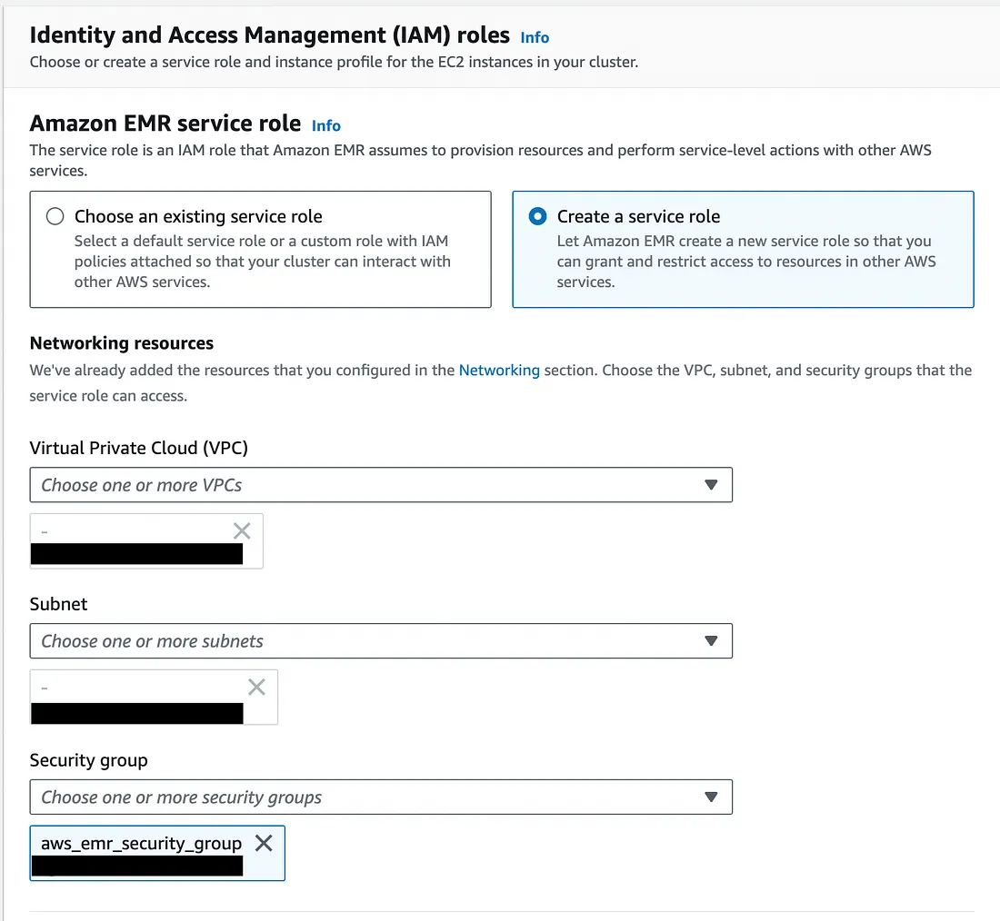

We can choose the key pair that is used for the EC2 instance.

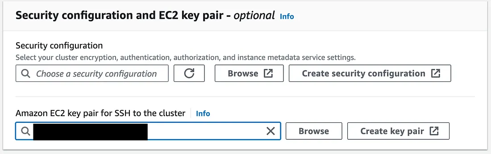

### Cluster Logs

We already created a dedicated bucket for our EMR logs. We can choose that bucket for the **Cluster logs** section. Please be careful that we choose directories, not files.

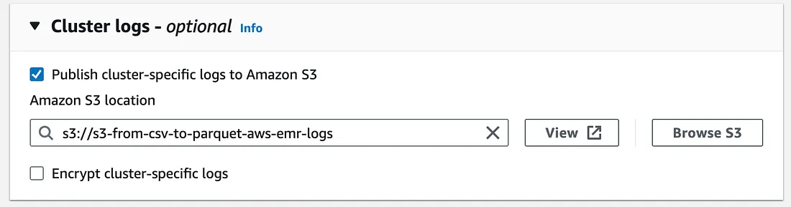

### S3 Access

Last but not least, we can allow access to S3 buckets, but it is not recommended for production use. We better specify the buckets we will use for our project.

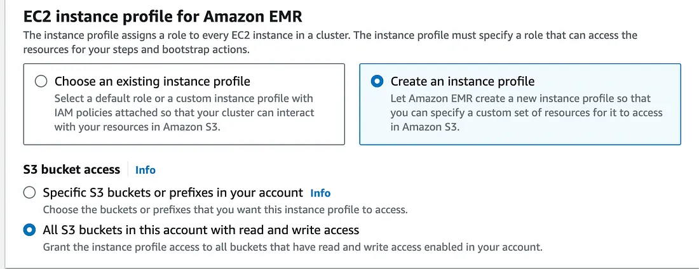

### Post-Creation Steps

After all, we can click on **Create cluster** button. Once created, the cluster will be running in about 5 minutes. We can see that the status will be "Waiting" instead of "Starting". Once created, we have to be careful about the following steps:

1. We should modify the IAM role for **Instance profile** of EC2. Once we click on the role's name on EMR dashboard, we will be redirected to the IAM page. We should add related S3 and Glue policies to the role so that we will be able to access S3 and Glue.

2. We should also modify the security group's inbound rules according to our use case. If we want to access the cluster from a specific service (Zeppelin notebook for example), we should define its security group ID as the inbound rule.

## Spark Job

📂 [View Zeppelin Notebook on GitHub](https://github.com/greenwichg/glue_etl_job_data_catalog_s3/blob/main/emr_zeppelin/emr_zeppelin_notebook.ipynb)

We will be using Zeppelin Notebook to run our Spark job. We should modify the inbound rule for Zeppelin Notebook's ID (For demo purposes, we can allow all IPs but this will make our cluster so vulnerable). After all, we will access the Zeppelin notebook in the **Applications** section. Now, we are going to go through the Spark job.

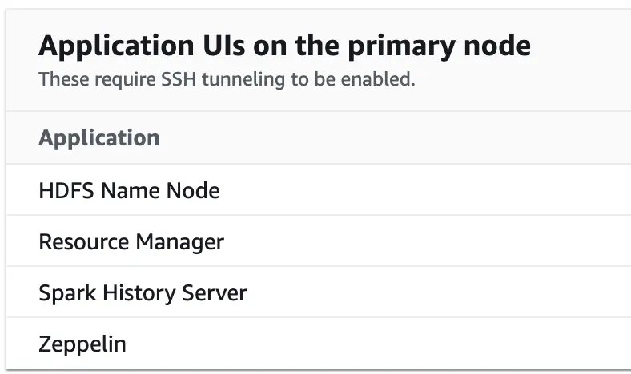

### Initialize Spark Session

First of all, we are going to choose Spark for the use purpose. Once we run the below code, our Spark session will be created.

```python
%pyspark
spark.version
```

### Import Required Libraries

Some libraries and packages will be required for the UDFs we are going to create. We will import all of them.

```python
%pyspark
from pyspark.sql.functions import regexp_replace, regexp_extract
from pyspark.sql.types import StringType, FloatType, IntegerType
```

### Load Data from S3

We are going to get the CSV data from the S3 bucket and will see its result.

```python
%pyspark
df = spark.read.format("csv")\
    .option("header", True)\
    .option("inferSchema", True)\
    .option("sep", ",")\
    .load("s3://dirty-transactions-from-csv-to-parquet/dirty_transactions/dirty_transactions.csv")

df.show(5)
```

### Load Data from Glue Data Catalog

We may also retrieve the data from the Glue Data Catalog table we already created.

```python
%pyspark
df_glue_table = spark.table("dirty-transactions-from-csv-to-parquet.dirty_transactions")

df_glue_table.show(5)
```

Since we defined the column names in lowercase for the Glue table, choosing `df_glue_table` as our main data frame will be a wise choice.

### Define and Register UDFs

Then, we are going to define and register UDFs for this specific use case. This part might differ depending on the use case of the project.

```python
%pyspark
def extract_city_name(string):
    cleaned_string = regexp_replace(string, r'[^\w\s]', '')
    city_name = cleaned_string.strip()
    return city_name

def extract_only_numbers(string):
    numbers = regexp_extract(string, r'\d+', 0)
    return ''.join(numbers)

def extract_floats_without_sign(string):
    string_without_dollar = regexp_replace(string, r'\$', '')
    return float(string_without_dollar)

spark.udf.register("extract_city_name", extract_city_name, StringType())
spark.udf.register("extract_only_numbers", extract_only_numbers, IntegerType())
spark.udf.register("extract_floats_without_sign", extract_floats_without_sign, FloatType())
```

### Apply UDFs and Create Final DataFrame

Once we define the UDFs, we can apply them to our main data frame and create the final data frame.

```python
%pyspark
# choose df_glue_table since column names are lowercase
df_final = df_glue_table.selectExpr(
    "store_id",
    "extract_city_name(store_location) as store_location",
    "product_category",
    "extract_only_numbers(product_id) as product_id",
    "extract_floats_without_sign(mrp) as mrp",
    "extract_floats_without_sign(cp) as cp",
    "extract_floats_without_sign(discount) as discount",
    "extract_floats_without_sign(sp) as sp",
    "date"
)

df_final.show(5)
```

### Write to S3 and Glue Data Catalog

To conclude, we are going to write our final clean data frame in the parquet format both to the S3 bucket and target Glue table as below. We can check both after the Spark job's run finishes.

```python
%pyspark
df_final.write\
    .saveAsTable('dirty-transactions-from-csv-to-parquet.clean_transactions', 
                 format='parquet', 
                 mode='overwrite',
                 path='s3://aws-glue-emr-from-csv-to-parquet/clean_transactions_parquet')
```

## Monitor the Data Using S3 Select and AWS Athena

Once we run the above Spark job using Zeppelin Notebook, we are going to see our resulting data both in the S3 bucket as a parquet file and as a Glue Data Catalog table.

### Query with Athena

We can run the below query in AWS Athena to see the most recent product_category and discount per store_location.

```sql
WITH dirty_transactions_rn AS (
  SELECT
    store_location,
    product_category,
    discount,
    row_number() OVER(PARTITION BY store_location ORDER BY date DESC) as rn
  FROM 'dirty-transactions-from-csv-to-parquet.clean_transactions'
)

SELECT
  store_location,
  product_category,
  discount
FROM dirty_transactions_rn
WHERE rn = 1
```

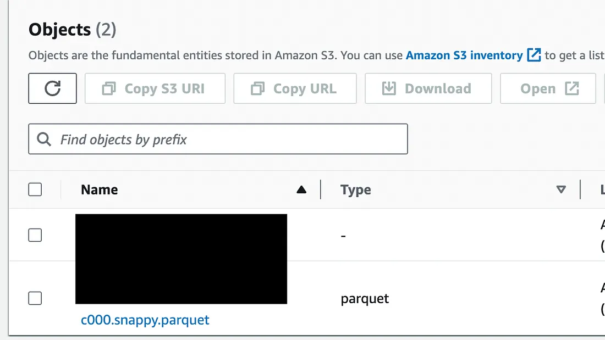

### S3 Select

We can also see the resulting data using **S3 Select** for the target parquet file in the S3 bucket. The below query will give us the below result.

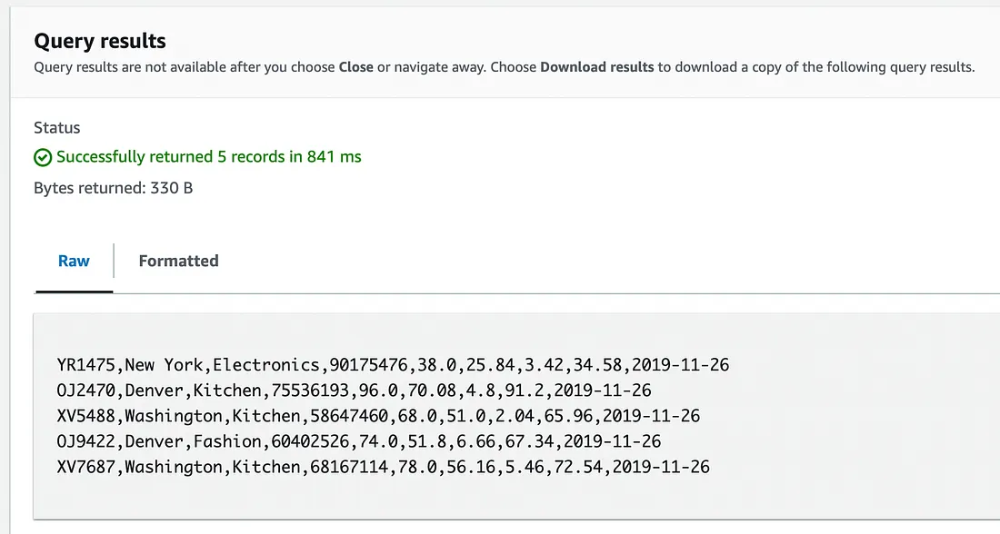

You may also see the [resulting parquet file here](https://github.com/greenwichg/glue_etl_job_data_catalog_s3/blob/main/data_sources/clean_transactions.snappy.parquet).

---
