# How to Stream CSV Data from Amazon Kinesis Data Streams to S3 Through Firehose


[](https://github.com/dogukannulu/csv_to_kinesis_streams)

## Tech Stack

- Amazon Kinesis Data Streams
- Amazon Kinesis Firehose
- Amazon S3
- Amazon EC2
- Shell Scripting
- Python

## Overview

- We are going to write a **Python** script that sends the CSV data line by line to **Kinesis Data Streams** with predefined regular time intervals.

- The script will be running with a **shell script** to make the process automated.

- All scripts will be located inside the **EC2** instance with suitable **IAM** roles.

- Once the data arrives in **Kinesis Data Streams**, it will be sent to **Firehose** and be buffered there for 1 minute.

- After buffering, the data will be transferred to the S3 bucket.

- Please keep in mind that all the services will be located in **eu-central-1**.

## Amazon S3 Bucket

The first thing we have to do is to create an S3 bucket that we will be using to ingest the data. From the S3 dashboard → Create bucket:

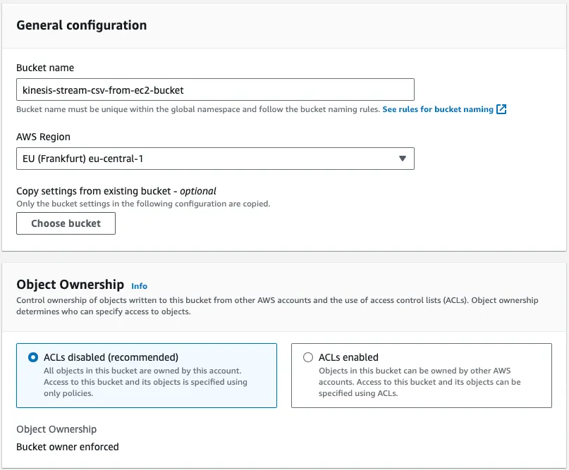

We can leave all other parameters as default. In the end, we can click on **Create bucket** (**`kinesis-stream-csv-from-ec2-bucket`**).

## IAM Role

We are going to create an IAM role that will give our EC2 instance permission to access Amazon Kinesis. Therefore, we can choose EC2 as the use case.

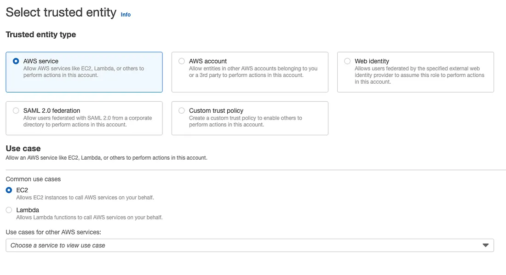

We are going to choose **AmazonKinesisFullAccess** as the role. It's not a best practice, but since this is a practical guide, we can choose this role. We should, instead, create a dedicated JSON for the specific streams. In the end, we can give it the name `ec2-kinesis-full-access`.

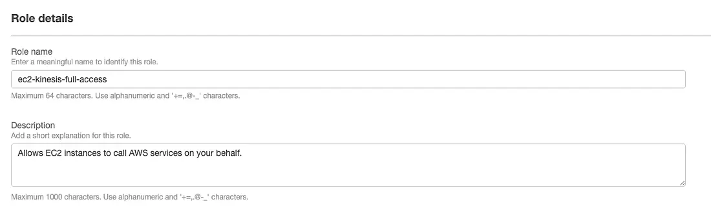

## EC2 Instance

We should then create the dedicated EC2 instance with the following parameters:

- **Application and OS Images** → Amazon Linux (Free tier eligible)
- **Instance type** → t2.micro (free tier eligible)
- **Key pair** → We can choose the key pair we created and install .pem file to our local machine
- **Network settings** → Select the existing security group and we can select the one we created (It should include SSH connection as an inbound rule)
- We should choose the IAM role we lately created
- **Name:** **send-csv-to-kinesis-ec2-instance**
- We can leave other fields as default and launch the instance.

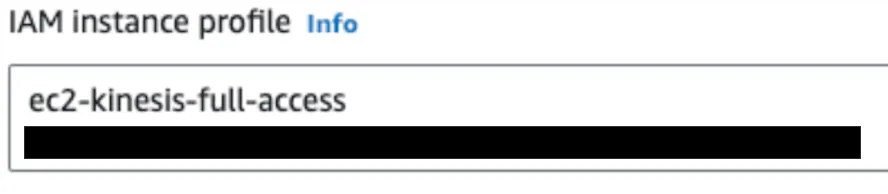

## Kinesis Data Streams

Amazon Kinesis → Data streams → Create data stream

We can choose **On-demand** or **Provisioned** with one shard since we will need only one shard for this project (We are going to use a hard-coded partition key. That's why we need one shard only.). We can name the Stream as **`streaming-ec2-csv`**.

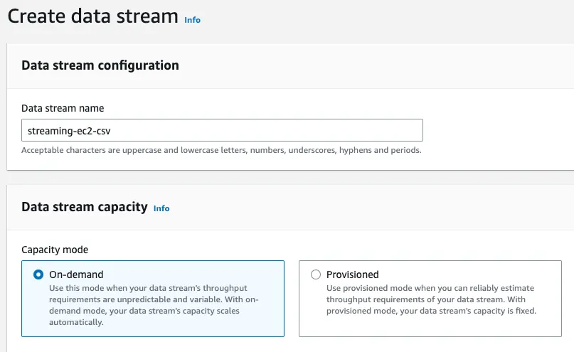

We can then click on **Create Data Stream**.

## Kinesis Firehose

When it comes to the Firehose, we have to select the source as **Data Streams** and the destination as **Amazon S3**. We have to populate our Data Stream name for the Source settings. We can name our Delivery stream name as **`firehose-streams-to-s3`**.

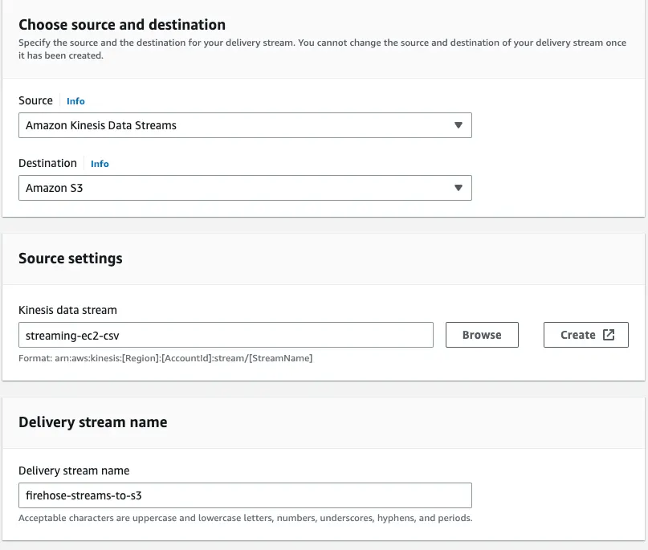

### Source Settings

For the Source settings, choose the Data Stream we created (**`streaming-ec2-csv`**).

### Destination Settings

When it comes to Destination settings, we can choose the S3 bucket we recently created. Data will be uploaded into the prefixes like **`year/month/day/hour`**.

### Buffer Configuration

And we should set **Buffer hints, compression and encryption** → **Buffer interval** as **60 seconds**. Because the Python script is going to send 60 lines and the time interval between two writes will be 2 seconds. To conclude, it will be uploaded into the S3 bucket as 2 separate files (60*2/60 = 2).

## Start Streaming

In this section, we will walk through all the scripts and how the streaming will work. Assuming we are already inside our EC2 instance (root directory) by connecting it via SSH, we are going to create a dedicated directory `/data` for our instance. Then, we will download the shell script to our instance, make it executable and run it.

```bash
sudo mkdir /data
cd /data
sudo curl -O https://raw.githubusercontent.com/dogukannulu/csv_to_kinesis_streams/main/setup.sh
sudo chmod +x setup.sh
./setup.sh
```

### Shell Script Overview

The `setup.sh` script will install pip3, python3, and wget first. Then, it will download the remote zip file (includes the Python script, requirements.txt and iris.csv) and run the Python script that will send the CSV data line by line to Kinesis Data Streams for a time interval. You may see the content of the script below.

```bash
#!/bin/bash

# install pip3, python3, wget
sudo yum update
sudo yum install python3
sudo yum install python3-pip
sudo yum install wget

# download the zip file
cd /data
sudo wget https://github.com/dogukannulu/csv_to_kinesis_streams/raw/main/csv_to_kinesis.zip

# Unzip the files
sudo unzip csv_to_kinesis.zip

# Install the required libraries
pip3 install -r requirements.txt

# Execute the Python script
sudo chmod +x data_streams.py
python3 data_streams.py --stream_name streaming-ec2-csv --interval 2 --max_rows 60
```

We may change the `interval` and `max_rows` command line arguments depending on your use case. Remember that the script will only work for iris.csv.

For a broader process that will be valid for all remote CSV files, you may see the article: [How to Automate Data Streaming to Amazon Kinesis Data Streams](https://github.com/greenwichg/aws_data_services_guidance/blob/main/materials/ec2_to_kinesis_streams.md)

## Python Script

Now, we are going to walk through the Python script. First, we have to import all necessary libraries and define global variables. They should've been installed once we run the shell script.

### Import Libraries and Global Variables

```python
import boto3
import csv
import time
import logging
import argparse

class GlobalVariables():
    csv_file_path = './iris.csv'
    kinesis_client = boto3.client('kinesis', region_name='eu-central-1')
```

### Define Command-Line Arguments

Since we have to use command-line arguments, we should first define them as a function.

```python
def define_arguments():
    """
    Defines the command-line arguments 
    """
    parser = argparse.ArgumentParser(description="Send CSV data to Kinesis Data Streams")
    parser.add_argument("--stream_name", "-sn", required=True, help="Name of the Kinesis Data Stream")
    parser.add_argument("--interval", "-i", type=int, required=True, help="Time interval (in seconds) between two writes")
    parser.add_argument("--max_rows", "-mr", type=int, default=150, help="Maximum number of rows to write (max: 150)")
    args = parser.parse_args()

    return args
```

**Arguments:**
- **stream_name**: We are going to define the stream name (**`streaming-ec2-csv`** for this project)
- **interval**: We have to define it as an integer. This will determine how many seconds will be required between two writes
- **max_rows**: How many rows do we want to write to the stream? Should be defined as an integer

### Determine Partition Key

We should now define how the partitions will be determined. There will be 3 partitions which will be defined with the below function. It means that we can monitor each species name by filtering due to the partition key. We are going to separate it. Remember that, the order is promised per shard for Kinesis Data Streams.

```python
def determine_partition_key(species):
    """
    Data will be partitioned due to species name
    """
    partition_key_mapping = {
        'Iris-setosa': '1',
        'Iris-versicolor': '2',
        'Iris-virginica': '3'
    }
    return partition_key_mapping.get(species, 'unknown')
```

If the species doesn't exist in the JSON, the partition key will be **`unknown`**.

### Send CSV to Kinesis

Here comes the main part. We are going to send the CSV data line by line separated with commas to the stream. The partition key will be determined due to the previous method. Once the max row limit is reached, it will break the loop and finish writing.

```python
def send_csv_to_kinesis(stream_name, interval, max_rows, csv_file=GlobalVariables.csv_file_path):
    client = GlobalVariables.kinesis_client

    with open(csv_file, 'r') as file:
        csv_reader = csv.reader(file)
        next(csv_reader)  # Skip the header row

        rows_written = 0
        for row in csv_reader:
            species = row[-1]  # Last column contains the species name
            partition_key = determine_partition_key(species)
            data = ','.join(row)
            encoded_data = f"{data}\n".encode('utf-8')  # Encode the data as bytes
            
            response = client.put_record(
                StreamName=stream_name,
                Data=encoded_data,
                PartitionKey=partition_key
            )
            logging.info(f"Record sent: {response['SequenceNumber']}")

            time.sleep(interval)

            rows_written += 1
            if rows_written >= max_rows:
                break
```

### Main Execution

In the end, we are going to call the arguments and if the defined `max_rows` exceeds 150 for this specific dataset, it will be set to 150.

```python
args = define_arguments()

if args.max_rows > 150:
    logging.warning("Warning: The maximum number of rows cannot exceed 150. Setting max_rows to 150.")
    args.max_rows = 150

send_csv_to_kinesis(args.stream_name, args.interval, args.max_rows)
```

### Script Execution Logs

Once we run the shell script, we will start seeing each write's log on the command line of the EC2 instance. We can see that the time interval is 2 seconds between two writes as we defined in the shell script.

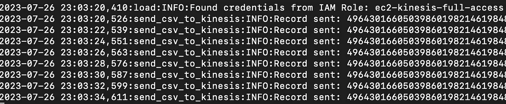

The long number at the right-hand side is the sequence number.

> A Kinesis data stream is a set of shards. Each shard has a sequence of data records. Each data record has a sequence number that is assigned by Kinesis Data Streams (Amazon Web Services).

## Monitor the Data on Kinesis Data Streams and S3 Bucket

We are going to see the partition keys of each species on the Data Streams dashboard. We can check if so on the Kinesis Data Streams dashboard by choosing **Trim Horizon** and getting the data from the shard. We should check to which shard our data was written (if we use On-demand mode) and adjust that shard to obtain the results.

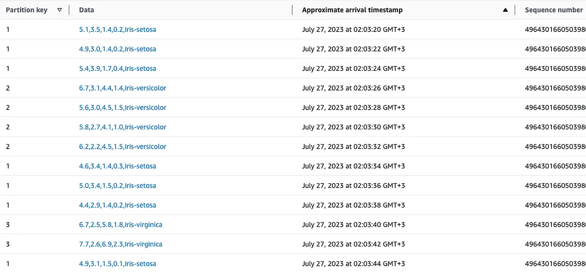

### Partition Key Benefits

The good part of the partition key is that we can sort the records by partition key and can see each species data ordered and separated.

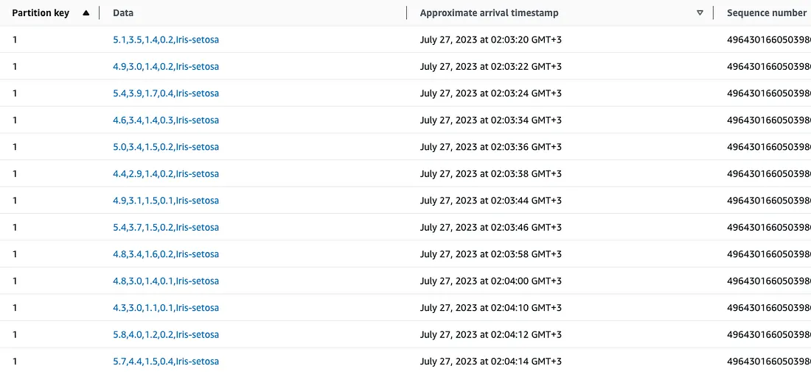

### Check S3 Bucket

We can also check the S3 bucket. We determined the buffer time limit as 60 seconds for Firehose. We are going to send the data every 2 seconds and 60 rows in total. It will take 2 minutes in total to write the whole data. **Therefore, there should be 2 separate files for the written data as we can see below.** If there are more than 2 files, it is probably because of the time differences during the delivery. You may also see the prefixes of the data which show `year/month/day/hour`. The file name will be determined due to the Delivery Stream name and date.

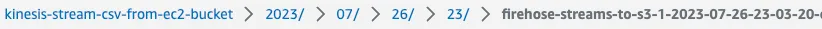

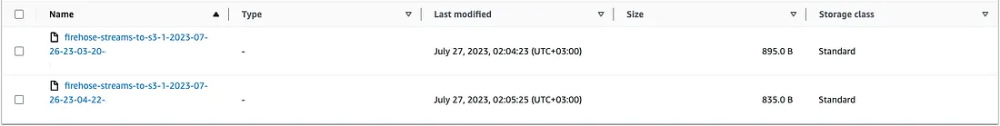

We can select each of the files and download them to our local. In the end, we will be able to see CSV data with our favorite text editor.

---
